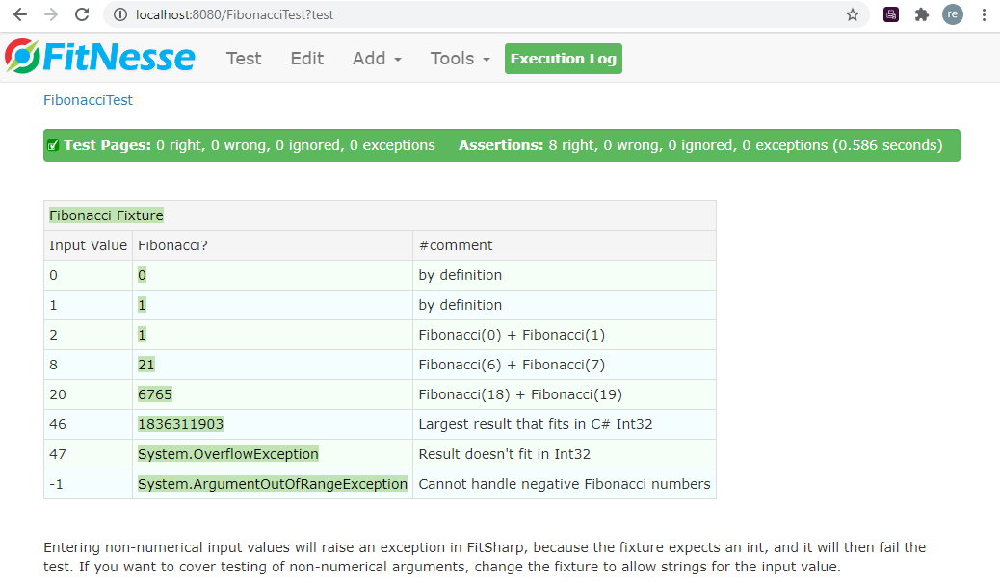

# Fibonaci Demo 

# Introduction 
This repo contains a demo on how to setup and use FitNesse with FitSharp. It include a FitNesse test page as well as a corresponding C# fixture. 

# Installation and Startup

## Windows
 1. Ensure you have a Java JRE installed (version 8 or higher, preferably 11). OpenJDK 11 has been tested and works well. There is an [issue with more recent versions of Java (17+)](java-security-manager-issue.md).
 3. Ensure that you have either the [.NET 6 SDK or the .NET 6 runtime](https://dotnet.microsoft.com/download/dotnet/6.0) installed (check by typing `dotnet` in a command prompt). If you want the SDK you need admin privileges, for the runtime that isn't necessary if you use the binaries (not the installer). Note that you need the plain .NET Runtime (not the Desktop Runtime or the ASP.NET Core runtime).
 4. Ensure that both Java and dotnet are in the path.
 5. Create folder for FitNesse: `mkdir %LOCALAPPDATA%\FitNesse` 
 6. Download FitNesse from http://fitnesse.org/FitNesseDownload and copy or move `fitnesse-standalone.jar` to `%LOCALAPPDATA%\FitNesse`
 7. If you don't have the NuGet CLI already, get it from https://dist.nuget.org/win-x86-commandline/latest/nuget.exe).
 8. Install FitSharp: `nuget install fitsharp -OutputDirectory %LOCALAPPDATA% -ExcludeVersion`
 9. Download this repo as a zip file (use the `<> Code` button in the root of the repo in GitHub)
 10. Extract the contents (not the folder itself) of `FitNesseFitSharpFibonacciDemo-master` of the zip file into `%LOCALAPPDATA%\FitNesse`.  
 11. Verify that the file `plugins.properties` is in the folder `%LOCALAPPDATA%\FitNesse` afterwards (this is FitNesse's configuration file).
 12. If you have a .NET 6 SDK installed, build the solution:
     1. Go to the solution folder : `cd /D %LOCALAPPDATA%\FitNesse\ExtendedMath`
     2. Build the fixture solution: `dotnet build --configuration release ExtendedMath.sln`
     3. Go to the fixture folder: `cd ExtendedMathFixtures`
     4. Publish the fixture including potential dependencies:<br/>`dotnet publish ExtendedMathFixtures.csproj --output bin\Deploy\net6.0 --framework net6.0 --configuration release`
 13. If you don't have .NET 6 SDK, download `ExtendedMathFixtures.zip` from the latest [Release](../../releases) and extract it into the `ExtendedMathFixtures` folder. It should create the folder tree `bin\Deploy\net6.0` with the DLLs and some other files in there.
 14. Go to the fixture assembly folder: `cd bin\Deploy\net6.0`
 15. Start FitNesse: `java -jar %LOCALAPPDATA%\FitNesse\fitnesse-standalone.jar -d %LOCALAPPDATA%\FitNesse -e 0`	

## Mac
1. Install [HomeBrew](https://brew.sh). This might require administrative privileges.
1. Install a Java JRE (preferably 11) if you don't have one already: `brew install java11`
1. Add Java to the path: `echo 'export PATH="/usr/local/opt/openjdk@11/bin:$PATH"' >> ~/.zshrc`
1. Create a folder for FitNesse: `mkdir ~/Documents/FitNesse`
1. Download FitNesse from  http://fitnesse.org/FitNesseDownload and copy or move `fitnesse-standalone.jar` to `~/Documents/FitNesse`
1. Install nuget: `brew install nuget`
1. Install FitSharp: `nuget install fitsharp -OutputDirectory ~/Documents -ExcludeVersion`
1. Download this repo as a ZIP file (use the `<> Code` button in the root of the repo in GitHub) 
1. Extract the contents of the folder `FitNesseFitSharpFibonacciDemo` of the zip file into `~/Documents/FitNesse`. 
1. Verify that the file `plugins.properties` is in that folder afterwards (this is FitNesse's configuration file).
1. Remove or comment out the Windows specific lines in `plugins.properties`, and uncomment (remove `#`) the Mac specific ones.
1. If you installed any applications via brew, start a new terminal window to ensure commands are found.
1. Go to the solution folder : `cd ~/Documents/FitNesse/ExtendedMath`
1. Build the fixture solution: `dotnet build --configuration release ExtendedMath.sln`
1. Go to the fixture folder: `cd ExtendedMathFixtures`
1. Publish the fixture including potential dependencies: `dotnet publish ExtendedMathFixtures.csproj --output bin/Deploy/net6.0 --framework net6.0 --configuration release`
1. Go to the fixture assembly folder: `cd bin/Deploy/net6.0`
1. Start FitNesse: `java -jar ~/Documents/FitNesse/fitnesse-standalone.jar -d ~/Documents/FitNesse -e 0`

## Validation (for both)
1. The first time FitNesse runs, it will unpack its resources. Wait until you see `Starting FitNesse on port: 8080` in the log
    ```
    Bootstrapping FitNesse, the fully integrated standalone wiki and acceptance testing framework.
    root page: fitnesse.wiki.fs.WikiFilePage: FitNesseRoot
    logger: none
    authenticator: fitnesse.authentication.PromiscuousAuthenticator
    page factory: fitnesse.html.template.PageFactory
    page theme: bootstrap
    Unpacking new version of FitNesse resources. Please be patient...
    **********************************************************
    Files have been updated to a new version.
    Please read the release notes on
    http://localhost:8080/FitNesse.ReleaseNotes
    to find out about the new features and fixes.
    **********************************************************
    Starting FitNesse on port: 8080
    ```

    In case you see something else, validate that Java was correctly installed and that the location of `fitnesse-standalone.jar` is correctly specified.

  1. Open a browser and enter the URL http://localhost:8080/FibonacciTest?test. If you then see a test table with Fibonacci numbers, you have configured FitNesse and FitSharp correctly.



## Troubleshooting
Check the [Troubleshooting page](../../wiki/A-Troubleshooting) in the Wiki.

# More information
See the [Wiki](../../wiki).

# Contribute
Enter an [issue](../../issues) or provide a pull request. 
